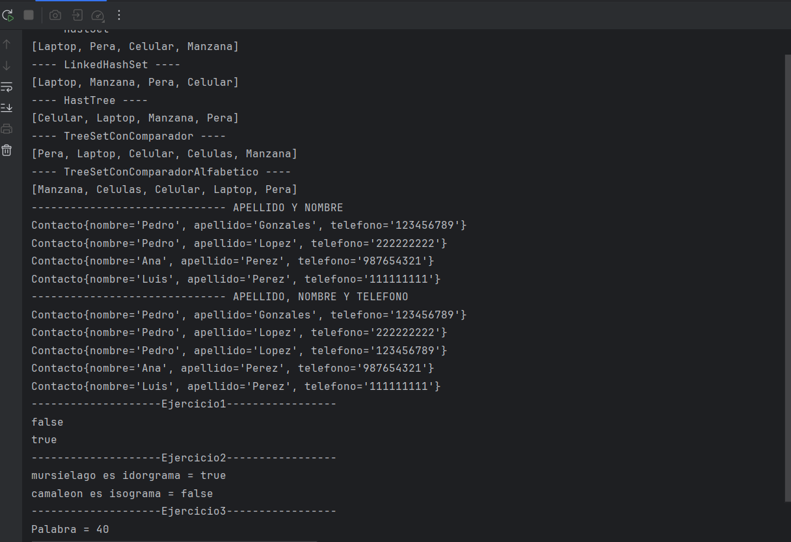

# Metodo Sets

## 📌 Información General

- **Título:** Metodo Sets
- **Asignatura:** Estructura de Datos
- **Carrera:** Computación
- **Estudiante:** Erick Yunga
- **Fecha:** 7/1/2025
- **Profesor:** Ing. Pablo Torres

---

